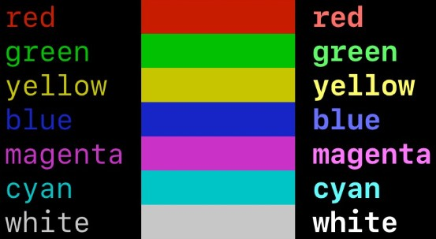

# Journal User Config

Default path for config file:

-   **Windows**: `C:\Users\USERNAME\AppData\Roaming\Journal\config.yml`
-   **MacOS**: `/Users/USERNAME/Library/Application Support/Journal/config.yml`
-   **Linux**: `/home/USERNAME/.config/Journal/config.yml`

## ⚠️ Note

**_If the same value is used for different keybindings, the bindings will have an unpredictable behaviour._**

## Default Config

```yaml
cli:
    mouseEnabled: true # support mouse & touch events
    editor: 'in-built' # or editor command e.g. 'default', 'code', 'vim'
    confirmOnQuit: false # show prompt when exiting cli app
    scrollHeight: 2 # how many lines you scroll by
    scrollPastBottom: true # enable scrolling past the bottom
keybindings:
    normalMode:
        undo: 'z' # undo last change
        redo: 'y' # redo a reverted change
        new: 'n' # create a new note, author or tag (depends on panel in focus)
        edit: 'e' # edit highlighted item
        prevTab: '[' # go to the tab by the left
        nextTab: ']' # go to the tab by the right
        scrollUpMain-alt: '<' # scroll to the top of focused panel; <pgup>
        scrollDownMain-alt: '>' # scroll to the bottom of focused panel; <pgdown>
        delete: 'd' # delete selected item(s) [note, author or tag]
        archive: 'a' # archive selected note(s)
        refresh: 'r' # refresh the list of notes, authors or tags (depends on panel in focus)
        pin: 'p' # pin highlighted note to the home view (max 4 pins)
        save: 's' # save highlighted note
        select: 'x' # select highlighted item in the focused panel (toggles)
        clearSelection: 'c' # unselect all items in the focused panel (toggles)
        invertSelection: 'k' # invert selected item(s) in the focused panel (toggles)
        displayHelp: 'h' # display help
        displayHelp-alt: '?' # display help
        toggleScreenMode: 't' # toggle size of highlighted item (normal/half/fullscreen)
        showConfig: ',' # show Journal settings
    searchMode:
        nextMatch: 'n' # go to the next item (direction: right, down)
        prevMatch: 'N' # go to the previous item (direction: left, top)
    insertMode:
gui:
    layout:
    theme:
        lightTheme: false # terminal with a light background
web:
    port: 9001 # port on localhost to launch web server
```

## Editor Config

When `cli.editor` is set to `default`, the default app for the file type is used.

```yaml
cli:
    editor: 'default'
```

Notes, authors & tags are saved as plain text files.

## Default Colors



-   Black
-   Red
-   Green
-   Yellow
-   Blue
-   Magenta
-   Cyan
-   White

## Example Themes

### Light terminal theme

```yaml
gui:
    theme:
        lightTheme: true
        # key: value
```
